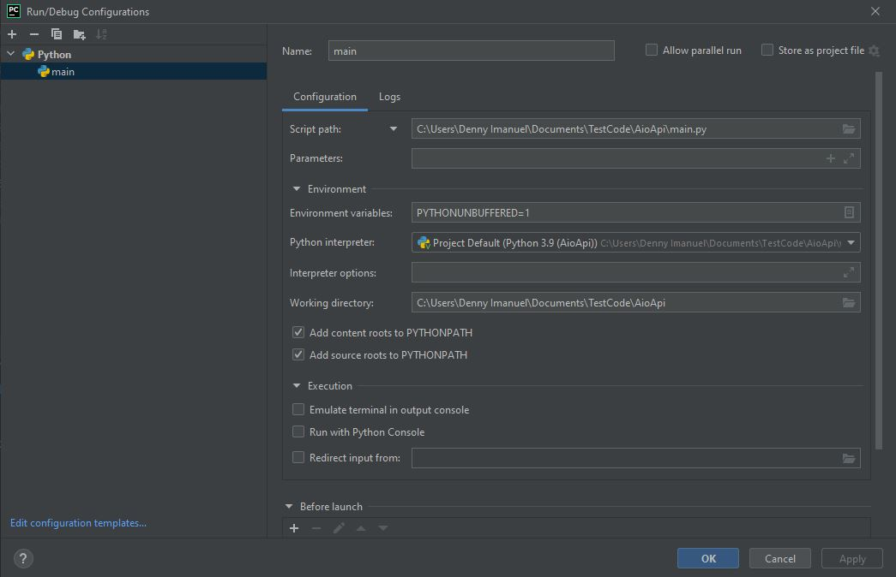
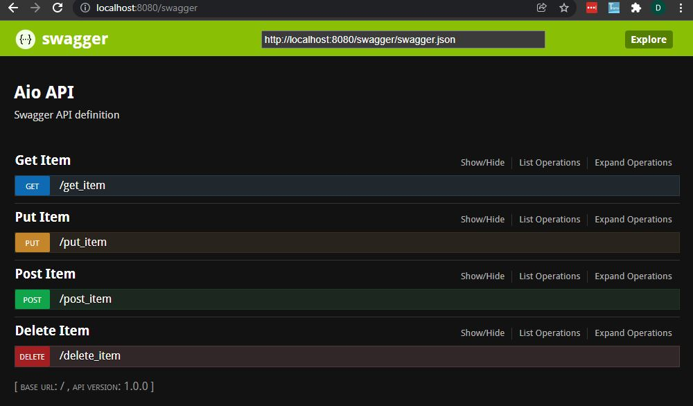

# Aio Swagger
by Denny Imanuel

This project shows how to build Rest API complete with Swagger UI documentation using Python programming language and Aio Http framework.

### Requirement

1. Pycharm IDE - you need to install Pycharm on your Windows machine
2. Python - you need to install Python and set PYTHONPATH env

### Run Configuration

On Pycharm Run Configuration choose Python configuration and set as follows:

### Swagger UI

Run the browser on http://localhost:8080/swagger you'll see the Swagger UI:

